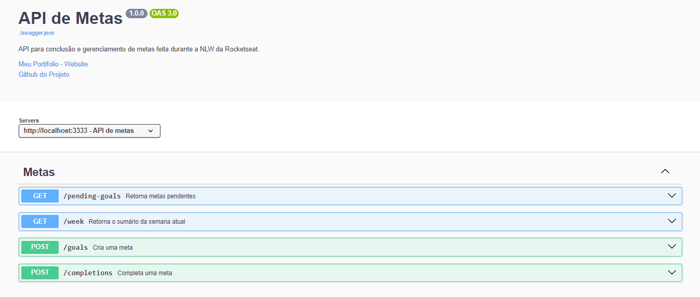

# in.orbit back-end


## Sobre ✏️
### Este é o servidor de uma aplicação chamada [in.orbit](https://github.com/Paulo-Mikhael/in-orbit-frontend?tab=readme-ov-file#readme), responsável por guardar e gerenciar as metas do usuário, elas são armazenadas em um banco de dados postgresql por um container docker e gerenciadas pelo framework back-end fastify. Além do mais, as rotas da aplicação podem ser acessadas visualmente por uma documentação swagger.

## Tecnologias 💻
<div>
  <abbr title="Node.js - Runtime Javascript">
    
  </abbr>
  <abbr title="Typescript - Linguagem fortemente tipada">
    
  </abbr>
  <abbr title="Fastify - Framework back-end" >
    
  </abbr>
  <abbr title="Docker - Serviço de containers" >
    
  </abbr>
  <abbr title="Postgres - Banco de dados relacional" >
    
  </abbr>
</div>

## Bibliotecas 📚
<div>
  <abbr title="Drizzle - ORM (Object-Relational Mapping), para manipular dados do banco" >
    
  </abbr>
  <abbr title="ZOD - Validação de dados" >
    
  </abbr>
  <abbr title="Biome - Formatação de código automática">
    
  </abbr>
</div>

## Estrutura principal do Projeto 🗃️
```plaintext
src
├── db/
│   ├── index.ts
│   ├── schema.ts
│   └── seed.ts
├── functions/
│   └── ...
├── http/
│   ├── routes/
│   │   └── ...
│   └── server.ts
└── env.ts
```
### Descrição:
- src - Contém todos os componentes da aplicação;
- db - Contém os arquivos que conectam a aplicação ao banco de dados, em index.ts fica a conexão ao banco, em schema.ts, as tabelas, e em seed.ts, uma função que insere alguns dados inicias no banco;
- functions - as funções que inserem e retornam dados ao banco;
- http - dentro de routes, ficam os arquivos responsáveis por cada rota individual, e são agrupadas dentro de server.ts;
- env.ts - fica as variáveis que pegam seus valores do arquivo .env da raíz do projeto, com ajuda da biblioteca ZOD;

## Rodando Localmente (Prompt) 📟
### Caso não tenha, instale o [docker desktop](https://www.docker.com/products/docker-desktop/), e deixe-o aberto/segundo plano (importante)
### Clone o projeto
```bash
  git clone https://github.com/Paulo-Mikhael/in-orbit-backend
```
### Entre no diretório do projeto
```bash
  cd in-orbit-backend
```
### Instale as dependências
```bash
  npm install
```
### Execute o container docker (caso não funcione, certifique-se de estar no diretório do projeto e de estar seguindo o passo 1)
```bash
  docker compose up
```
### Insira alguns dados iniciais (opcional)
```bash
  npm run seed
```
### Inicie o servidor
```bash
  npm run dev
```

## Rotas 🗺️
### Caso tenha seguido todos os passos de "[Rodando Localmente](#rodando-localmente-prompt-)", a documentação swagger estará disponível na url [http://localhost:8301](http://localhost:8301)
### Criar meta:
```bash
  POST "/goals"
  Content-Type: application.json
  body: {
    title: string,
    desiredWeeklyFrequency: number,
  }
```
### Completar meta:
```bash
  POST "/completions"
  Content-Type: application.json
  body: {
    goalId: string
  }
```
### Retornar metas pendentes da semana:
```bash
  GET "/pending-goals"
  // retorna:
  {
    id: string;
    title: string;
    desiredWeeklyFrequency: number;
    completionCount: number;
  }[]
```
### Retornar sumário da semana:
```bash
  GET "/week"
  // retorna:
  {
    completed: number;
    total: number;
    goalsPerDay: Record<string, {
        id: string;
        title: string;
        completedAt: string;
    }[]>;
  }
```

## Talvez você queira ver 💡
  ### [Portifólio](https://portifolio-react-three.vercel.app/)
  ### [Currículo](https://docs.google.com/document/d/1xhimUtV6EM7c1GtwBwAHsIonX1HjoLSi/edit)

## Confira meus outros projetos 🛠️
  - [in.orbit (front-end) - Aplicação de metas pessoais](https://github.com/Paulo-Mikhael/in-orbit-frontend?tab=readme-ov-file#readme)
  - [Blog PHLOX - Blog de uma empresa de tecnologia](https://github.com/Paulo-Mikhael/phlox-blog?tab=readme-ov-file#readme)
  - [Fastask - Gerenciador de Tarefas](https://github.com/Paulo-Mikhael/fastask?tab=readme-ov-file#readme)
  - [Landing Page para uma academia](https://github.com/Paulo-Mikhael/academia-landing-page?tab=readme-ov-file#readme)
  - [Landing Page para um e-commerce de tech](https://github.com/Paulo-Mikhael/phlox?tab=readme-ov-file#readme)
  - [Landing Page para um e-commerce de plantas](https://github.com/Paulo-Mikhael/casa-verde?tab=readme-ov-file#readme)

## Contatos 📞
  [](https://portifolio-react-three.vercel.app/contacts)
  [](https://www.linkedin.com/in/paulo-miguel-4b706022b/)
  [](https://www.instagram.com/pa__miguel?igsh=MWxoYzdqNGluZWcyaA%3D%3D)
  [](https://api.whatsapp.com/send/?phone=5592992813253&text=Ol%C3%A1%21+Gostaria+de+fazer+uma+oferta...&type=phone_number&app_absent=0)
